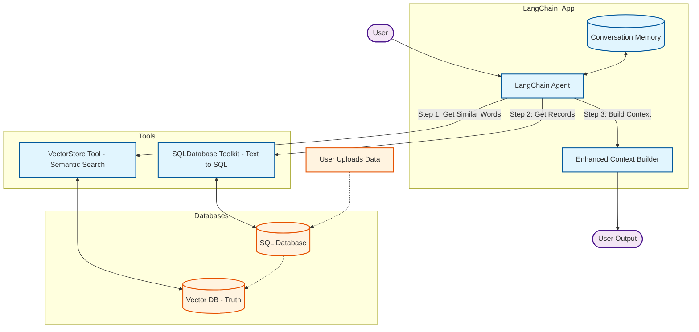

```mermaid
flowchart TD
    %% 1. USER (Top)
    User([User])

    %% 2. ORCHESTRATION LAYER (Stacked Vertically)
    subgraph LangChain_App
        direction TB
        Memory[(Conversation Memory)]
        Agent[LangChain Agent]
        Context[Enhanced Context Builder]
    end

    %% 3. TOOLS LAYER (Stacked Vertically to save width)
    subgraph Tools
        direction TB
        VectorTool[VectorStore Tool - Semantic Search]
        SQLTool[SQLDatabase Toolkit - Text to SQL]
    end

    %% 4. DATA LAYER (Stacked Vertically)
    subgraph Databases
        direction TB
        VecDB[(Vector DB - Truth)]
        SQL[(SQL Database)]
    end

    %% 5. INPUTS/OUTPUTS (Bottom)
    UserUploads[User Uploads Data]
    Output([User Output])

    %% --- CONNECTIONS ---

    %% Flow: User -> Agent
    User --> Agent
    
    %% Flow: Agent <-> Memory
    Memory <--> Agent

    %% Flow: Semantic Search
    Agent -- Step 1: Get Similar Words --> VectorTool
    VectorTool <--> VecDB

    %% Flow: SQL Search
    Agent -- Step 2: Get Records --> SQLTool
    SQLTool <--> SQL

    %% Flow: Output
    Agent -- Step 3: Build Context --> Context
    Context --> Output

    %% Flow: Data Ingestion (From bottom up)
    UserUploads -.-> SQL
    SQL -.-> VecDB

    %% --- STYLING ---
    classDef logic fill:#e1f5fe,stroke:#01579b,stroke-width:2px;
    classDef storage fill:#fff3e0,stroke:#e65100,stroke-width:2px;
    classDef actor fill:#f3e5f5,stroke:#4a148c,stroke-width:2px;

    class Agent,Context,VectorTool,SQLTool,Memory logic;
    class VecDB,SQL,UserUploads storage;
    class User,Output actor;
```